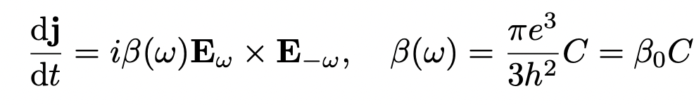
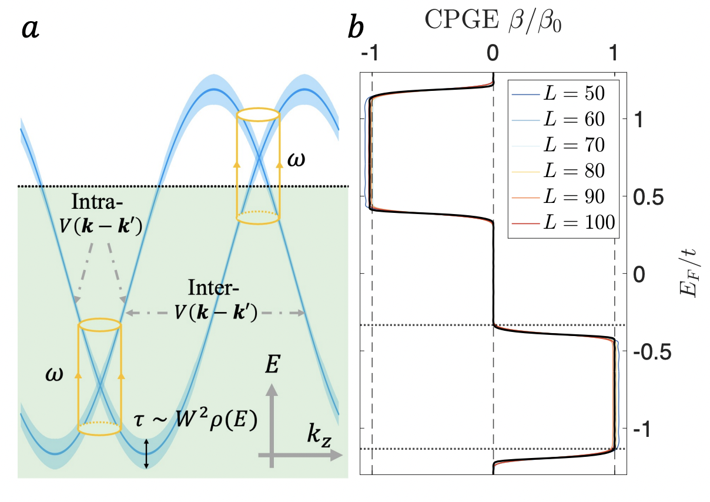
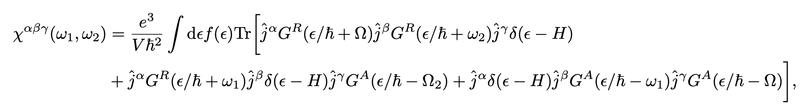
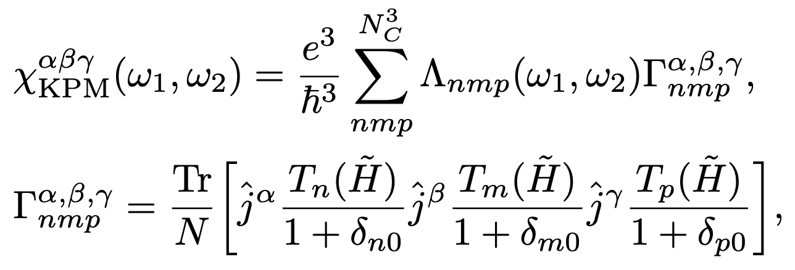
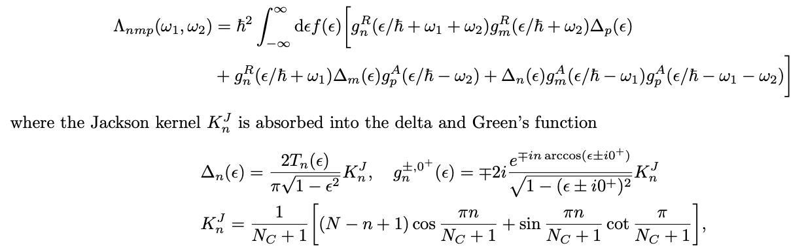

# KPM-NonLinResp-CPGE

Physics of the repo:

Model based computation of the circularly polarized photogalvanic effect (CPGE) based in 3D chiral Weyl semimetals using a triple Chebyshev expansion within the kernel polynomial method (KPM) approach in https://arxiv.org/abs/2312.14244 (https://doi.org/10.1103/PhysRevB.110.014201). Based on a time reversal broken Weyl semimetal, we break the mirror symmetries making it chiral with Weyl nodes at two different places in energy. As a result, the CPGE


<!--Text-->
<!---->


becomes quantized for optical frequencies encompassing the Weyl code above the Fermi energy. The dispersion and CPGE in the clean limit showing the quantization is below.


<!---->

This repository evaluates this CPGE within a KPM based appraoch on GPUs. It expands the Kubo expression below (inovlving 3 current operatrors) with 3 Chebyshev based expansions. 


<!---->

This gives rise to the KPM expression


<!---->

where $\Lambda$ is given by


<!---->

How to use the code base in the repo:
First download the repo to a local directory, i.e., `./KPM-NonLinResp-CPGE/`
```julia
julia>]

pkg> dev ./KPM-NonLinResp-CPGE/
```
To use the model functions (2-band lattice model)
```julia
using CPGE
```
Key functions in the CPGE package 
```julia
export TwoBandModel,velocityOperator,generatePotDisorder
export dispersion, spectrum
```
All the KPM functionalities are from the KPM.jl package.

To utilize the package to obtain the non-linear response, the example codes are in the folder `examples`. The logica flow to compute large-scale disordered is, to first run the codes
```julia
julia collectHdis.jl 1
```
where the number `1` denote the index of the disorder sample (typically can get 100 samples). This is the only part requires the CPGE package. It will store the normalized Hamiltonian and current operators
```julia
H_norm,D, Jx,Jy, Jz
```
`D` is the half-bandwidth.

Then, use `collectGammaPartial.jl` to obtain the triple KPM expansion $\Lambda$ for each disorder sample index $1-100$. Note that we need to run it twice for current  $\Lambda^{xyz}, \Lambda^{yxz}$ by switching current operators.

The code `combineResults.jl` will average the KPM moments of the $100$ samples and combines them into one set of $\Lambda^{xyz}, \Lambda^{yxz}$.

Finally, `CPGEfromGammaNCs.jl` will generate the CPGE response from the KPM moments with various expansion order $N_C$.

Folders with `HPCBackup` contains codes for various HPC systems and `codes` folder contains all the raw codes.